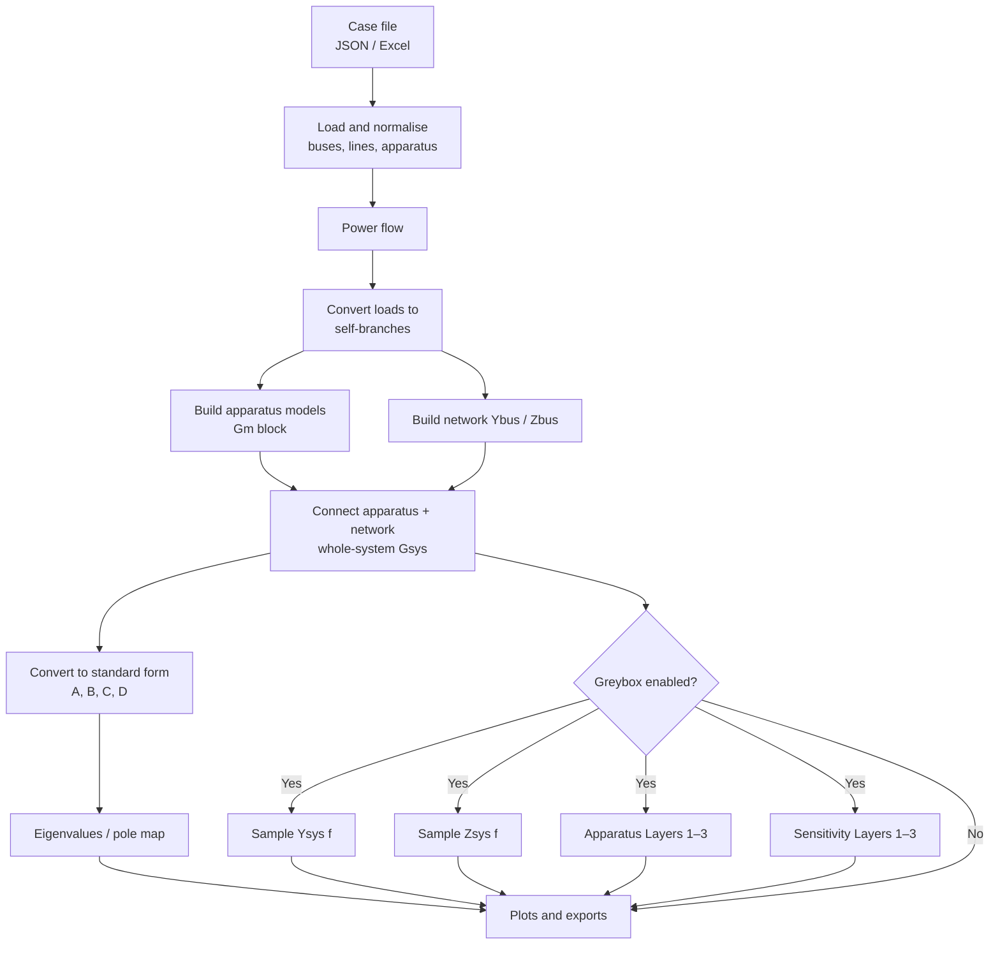

# SimplusGT Python — User Guide

This guide explains the **Python** version of Simplus Grid Tool: what it does, how to run it, how the modules fit together, and the mathematics behind the whole-system model and greybox layers.

It is written for readers who may **not** already know state-space control theory. Mathematical ideas are introduced with power-system intuition first, then the formulas used in the code.

> Related files: [`UserMain.py`](../UserMain.py) (entry point), [`PYTHON.md`](../PYTHON.md) (install / scope), MATLAB manuals under `Documentations/`.

---

## 1. What the Python tool does

Given a power-system case file (JSON or Excel), the tool:

1. Solves the **power flow** (steady-state voltages and power).
2. Builds a **dynamic model** of every apparatus (generator, inverter, …) and of the **network**.
3. Connects them into one **whole-system** model.
4. Computes **eigenvalues** (natural oscillation modes) to judge small-signal stability.
5. Optionally runs **greybox / impedance participation** analysis (Ysys, Zsys, Layers 1–3).
6. Optionally **plots** and **exports** results (PNG, JSON, Excel).

It does **not** create Simulink models or run synchronisation analysis (those remain MATLAB-only for now).

---

## 2. Quick start

### 2.1 Install

From the repository root:

```bash
pip install -e ".[dev]"
```

Requires Python 3.10+.

### 2.2 Run from one file

1. Open [`UserMain.py`](../UserMain.py).
2. Set `USER_DATA_NAME` (e.g. `"IEEE_14Bus"` or a path to a `.json` file).
3. Toggle the boolean feature flags (plots, greybox layers, Excel export, …).
4. Run the file:

```bash
python UserMain.py
```

or use your IDE’s “Run” button on `UserMain.py`.

Example settings:

```python
USER_DATA_NAME = "IEEE_14Bus"
ENABLE_PLOT_POLE = True
ENABLE_GREYBOX = True
ENABLE_GREYBOX_APP_LAYER1 = True
ENABLE_GREYBOX_APP_LAYER2 = True
ENABLE_GREYBOX_SENS_LAYER12 = True
ENABLE_EXPORT_GREYBOX_EXCEL = True
```

Outputs typically appear under `Results/` and `Results/plots/`.

---

## 3. End-to-end flowchart



**In one sentence:** the case becomes numbers → steady state → local device models + network → one closed system → modes and (optionally) impedance-based participation charts.

---

## 4. Step-by-step pipeline

| Step | What happens | Main module |
|------|----------------|-------------|
| 1. Load case | Read buses, lines, apparatus types/parameters, base frequency | `io.py`, `schema.py` |
| 2. Normalise | Sort/renumber lists into the internal netlist format | `netlists.py` |
| 3. Power flow | Solve for bus voltages and apparatus operating points | `powerflow.py` |
| 4. Load → branch | Represent loads as shunt branches so dynamics see them | `powerflow.py` |
| 5. Apparatus DSS | Linearise each device around its operating point | `models.py` |
| 6. Link apparatuses | Stack all devices into one multi-port block \(G_m\) | `models.py` |
| 7. Network DSS | Build network admittance \(Y_{\mathrm{bus}}\) and impedance \(Z_{\mathrm{bus}}\) | `network.py` |
| 8. Interconnect | Feedback: apparatus currents ↔ network voltages → \(G_{\mathrm{sys}}\) | `pipeline.py`, `dss.py` |
| 9. Standard SS | Reduce descriptor form to \(\dot{x}=Ax+Bu\), \(y=Cx+Du\) | `dss.py` |
| 10. Eigenvalues | Roots of \(A\) (or generalised eigenproblem) | `pipeline.py` |
| 11. Greybox (optional) | Frequency samples of Ysys/Zsys + modal layers | `greybox.py` |
| 12. Plots / export | Pole map, Bode, Excel/JSON | `plotting.py`, `export.py` |

This sequence is exactly what `run_case()` in `pipeline.py` performs; `UserMain.py` calls it and then optionally greybox / plotting / export.

---

## 5. Module structure

```text
Simplus-Grid-Tool/
├── UserMain.py              ← single user entry point (edit settings here)
├── PYTHON.md                ← install and scope notes
├── simplusgt/               ← Python package
│   ├── io.py                load JSON / Excel cases
│   ├── schema.py            case data structures
│   ├── netlists.py          bus/line/apparatus normalisation
│   ├── powerflow.py         power flow + load conversion
│   ├── models.py            apparatus linear models + linking
│   ├── network.py           network Ybus / Zbus DSS
│   ├── dss.py               descriptor state-space algebra
│   ├── pipeline.py          end-to-end run_case()
│   ├── greybox.py           Ysys, Zsys, Layers 1–3
│   ├── analysis.py          stability report, participation helpers
│   ├── plotting.py          MATLAB-style figures
│   ├── export.py            JSON + Excel export
│   └── cli.py               optional command-line (not required)
├── Examples/                example networks (shared with MATLAB)
├── Results/                 default output folder
└── Documentations/          manuals (this file included)
```

### Roles in plain language

| Module | Role |
|--------|------|
| `io` / `schema` | “Read the spreadsheet/JSON into Python objects.” |
| `netlists` | “Put buses and lines into a consistent order.” |
| `powerflow` | “Find the steady operating point.” |
| `models` | “Write small-signal equations for each machine/inverter.” |
| `network` | “Write equations for lines and shunts.” |
| `dss` | “Math toolkit to combine and reduce those equations.” |
| `pipeline` | “Glue everything into one system and find modes.” |
| `greybox` | “Ask who participates in a mode via impedance ideas.” |
| `plotting` / `export` | “Show and save results.” |

---

## 6. Feature list

### 6.1 Core analysis (always available via `UserMain`)

- JSON and Excel case loading  
- AC, DC, and hybrid AC–DC example networks under `Examples/`  
- Power flow (with DC forcing Gauss–Seidel when needed)  
- Apparatus library: SG, GFL/GFM VSI, BESS, PV, WT, DC buck, AC–DC interlinks, infinite/floating buses  
- Whole-system interconnection and eigenvalue calculation  
- Stability summary (stable / unstable from eigenvalue real parts)

### 6.2 Plots (toggle in `UserMain`)

| Flag | Figure |
|------|--------|
| `ENABLE_PLOT_POLE` | Global + zoomed pole map (Hz), with 10% damping lines |
| `ENABLE_PLOT_ADMITTANCE` | Bus admittance Bode: \(Y_{dd}\) and complex-vector \(Y_{dq+}\) |
| `ENABLE_PLOT_ADMITTANCE_DQ_AXES` | dd / dq / qd / qq Bode (MATLAB Modal `BodeDraw`) |
| `ENABLE_PLOT_GRID_STRENGTH` | Network layout coloured by bus admittance strength |
| `ENABLE_PLOT_GREYBOX` | Ysys/Zsys Bode + Layer 1 pie / Layer 2 bars |
| `ENABLE_HTML_DASHBOARD` | Interactive Plotly HTML dashboard (preferred for Layer 1/2/3) |

With `ENABLE_HTML_DASHBOARD = True`, `UserMain` writes `Results/<case>_dashboard.html` and opens it in the browser when `SHOW_PLOTS` is set. Mode Layer 1/2/3 charts use hover tooltips and a mode dropdown so labels stay readable (Layer 3 appears when `ENABLE_GREYBOX_APP_LAYER3` / sensitivity Layer 3 produce data). Matplotlib PNGs are written only when `SAVE_PLOTS = True`.

CLI equivalent:

```bash
simplusgt plot Examples/.../SgInfiniteBus.json --greybox --html-dashboard Results/SgInfiniteBus_dashboard.html --show
```

### 6.3 Greybox layers (boolean flags)

| Flag | Meaning |
|------|---------|
| `ENABLE_GREYBOX_APP_LAYER1` | Apparatus Layer 1 — “how strongly” a device is involved |
| `ENABLE_GREYBOX_APP_LAYER2` | Apparatus Layer 2 — signed damping / frequency shift sense |
| `ENABLE_GREYBOX_APP_LAYER3` | Apparatus Layer 3 — which **parameters** matter |
| `ENABLE_GREYBOX_SENS_LAYER12` | Network node/branch sensitivity Layers 1–2 |
| `ENABLE_GREYBOX_SENS_LAYER3` | Line \(R\)/\(X\) parameter sensitivity |

Even with all layer flags `False`, greybox still samples **Ysys** and **Zsys** when greybox analysis or Excel export is enabled.

### 6.4 Exports

| Flag | Output |
|------|--------|
| `ENABLE_EXPORT_GREYBOX_EXCEL` | `Results/<case>_greybox.xlsx` (Ysys, Zsys, layers) |
| `ENABLE_EXPORT_GREYBOX_JSON` | JSON greybox payload |
| `ENABLE_EXPORT_DASHBOARD` | Dashboard-oriented modal JSON |

### 6.5 Out of scope (Python)

- Automatic Simulink model generation  
- Synchronisation analysis (`Examples/TestSynchronisation/…` still run the core pipeline, but not Synchron)  
- Interactive MATLAB Modal Excel GUI

---

## 7. Intuition before mathematics

### 7.1 Steady state vs small signals

- **Power flow** answers: “At this loading, what are the voltages and powers?”  
- **Small-signal dynamics** answer: “If something is gently disturbed, does the system settle, and at what frequencies does it ring?”

The Python tool linearises every device around the power-flow point, then studies the resulting linear system.

### 7.2 Ports: voltage in, current out

Each AC bus (in the \(dq\) frame used by SimplusGT) has:

- **Inputs** to apparatuses: bus voltages \(v_d, v_q\)  
- **Outputs** from apparatuses: injected currents \(i_d, i_q\)

The network relates voltages and currents the other way around (admittance: \(I = Y V\)). Connecting apparatus and network is like closing Kirchhoff’s laws: the current leaving a device must equal the current entering the network at that bus.

### 7.3 What is an “eigenvalue” / “mode”?

Think of a lightly damped oscillation after a small disturbance:

\[
x(t) \approx e^{\sigma t}\cos(\omega t + \phi)
\]

- \(\sigma < 0\): decaying (stable)  
- \(\sigma > 0\): growing (unstable)  
- \(\omega\): oscillation frequency (rad/s); \(f = \omega/(2\pi)\) in Hz  

The eigenvalues \(\lambda = \sigma + j\omega\) of the system matrix \(A\) are exactly these \(\sigma\) and \(\omega\) for every natural mode of the linearised model. The pole map plots \(\mathrm{Re}(\lambda)\) vs \(\mathrm{Im}(\lambda)\) in Hz.

### 7.4 Admittance vs impedance

At a complex frequency \(s = j\,2\pi f\):

- **Admittance** \(Y(s)\): \(I(s) = Y(s)\,V(s)\) (“how much current for a voltage push”)  
- **Impedance** \(Z(s)\): \(V(s) = Z(s)\,I(s)\) (“how much voltage for a current push”)  

Whole-system **Ysys** and **Zsys** are the multi-bus versions of these ideas for the closed power system.

---

## 8. How the whole-system \(A\) matrix is formed

This section follows the code path in `pipeline.py` and `dss.py`.

### 8.1 Descriptor models (the raw form)

Each apparatus and each network branch is first written as a **descriptor** (generalised) state-space model:

\[
\begin{aligned}
E\,\dot{x} &= A\,x + B\,u \\
y &= C\,x + D\,u
\end{aligned}
\]

Why \(E\)? Some equations are **dynamic** (involve derivatives, e.g. inductor current) and some are **algebraic** (instantaneous Kirchhoff / controller algebraic loops). Putting a near-zero diagonal entry in \(E\) marks an algebraic variable. This matches MATLAB SimplusGT’s DSS representation.

**Plain reading:**

- \(x\): internal variables (currents, PLL angles, controller integrators, …)  
- \(u\): port inputs (voltages for current-source-style ports)  
- \(y\): port outputs (currents)  
- \(A,B,C,D,E\): matrices of numbers from linearisation

### 8.2 Apparatus block \(G_m\)

1. Linearise each apparatus at its power-flow point (`models.create_apparatus_model`).  
2. For rotating-frame devices, embed frame dynamics when required.  
3. Stack all apparatuses into one big multi-port model \(G_m\) (`link_apparatus`):

\[
i = G_m(s)\,v
\]

in the Laplace / frequency domain (multi-input multi-output).

### 8.3 Network \(Y_{\mathrm{bus}}\) and \(Z_{\mathrm{bus}}\)

`network.network_dss` builds the network descriptor model whose port map is:

\[
i_{\mathrm{net}} = Y_{\mathrm{bus}}(s)\,v,\qquad
v = Z_{\mathrm{bus}}(s)\,i_{\mathrm{net}}
\]

(with \(Z_{\mathrm{bus}}\) obtained by inverting / switching the network DSS as in MATLAB).

### 8.4 Closing the loop → \(G_{\mathrm{sys}}\)

The whole system enforces that apparatus currents feed the network and network voltages feed the apparatuses. In code this is selected-channel **feedback** (`dss.feedback`):

\[
G_{\mathrm{sys}} = \mathrm{feedback}\bigl(G_m,\, Z_{\mathrm{bus}}\bigr)
\]

on the voltage/current ports of every bus. The result is one descriptor model for the interconnected grid:

\[
E_{\mathrm{sys}}\dot{x} = A_{\mathrm{sys}} x + B_{\mathrm{sys}} u,\qquad
y = C_{\mathrm{sys}} x + D_{\mathrm{sys}} u.
\]

### 8.5 From descriptor to standard \(A\) (`dss2ss`)

Small-signal eigenvalues are easiest from the standard form

\[
\dot{x}_r = A\,x_r + B\,u,\qquad y = C\,x_r + D\,u.
\]

Conversion (`dss.dss2ss` / `to_state_space`):

1. Split states into **dynamic** (\(|E_{ii}|\) large) and **algebraic** (\(E_{ii}\approx 0\)).  
2. Solve algebraic equations for the algebraic variables.  
3. Substitute into the dynamic equations.  
4. Scale by the remaining \(E\) block so that the left side becomes \(\dot{x}_r\).

The matrix \(A\) that appears in eigenvalue analysis is this reduced dynamic matrix. Conceptually:

\[
A = E_r^{-1} A_r
\]

after algebraic elimination (exact formulas are in `dss2ss` for diagonal \(E\)).

### 8.6 Eigenvalues

With \(A\) available:

\[
A\,\phi = \lambda\,\phi
\]

- \(\lambda\): eigenvalue (mode)  
- \(\phi\): right eigenvector (mode shape in state coordinates)  
- left eigenvector \(\psi\) satisfies \(\psi A = \lambda \psi\) (used for residues)

If reduction fails, the tool falls back to the generalised problem \(A_{\mathrm{sys}}\phi = \lambda E_{\mathrm{sys}}\phi\).

---

## 9. How whole-system impedance \(Z_{\mathrm{sys}}\) is derived

### 9.1 Whole-system admittance \(Y_{\mathrm{sys}}\)

After interconnection, truncate \(G_{\mathrm{sys}}\) to the physical current outputs and voltage inputs (`port_i`, `port_v`):

\[
Y_{\mathrm{sys}}(s) = G_{\mathrm{sys}}(s)\big|_{\text{ports } i\leftarrow v}.
\]

Sampling at \(s = j\,2\pi f\) gives the Excel/JSON **Ysys** tables.

### 9.2 Apparatus multi-port admittance and its inverse

Let \(G_m^{\mathrm{trim}}(s)\) be the apparatus block restricted to the same voltage→current ports. Then, at each frequency,

\[
I(s) = G_m^{\mathrm{trim}}(s)\,V(s).
\]

The apparatus impedance (current→voltage) is the inverse:

\[
Z_m(s) = \bigl(G_m^{\mathrm{trim}}(s)\bigr)^{-1}.
\]

### 9.3 Network in parallel with apparatuses

At the same ports, the network contributes \(Y_{\mathrm{bus}}(s)\). Devices and network sit in **parallel** at the buses: for a given voltage, currents add.

The **closed-system** relation from injected current disturbance to voltage is therefore

\[
\boxed{
Z_{\mathrm{sys}}(s)
= \bigl( G_m^{\mathrm{trim}}(s) + Y_{\mathrm{bus}}(s) \bigr)^{-1}
}
\]

**Intuition:** \(G_m + Y_{\mathrm{bus}}\) is the total admittance “seen” when apparatuses and network are connected; inverting it yields the whole-system impedance.

Equivalently (MATLAB `WholeSysZ_cal` form):

\[
Z_{\mathrm{sys}} = \mathrm{feedback}\bigl(Z_m,\, Y_{\mathrm{bus}}\bigr)
= \mathrm{feedback}\bigl((G_m^{\mathrm{trim}})^{-1},\, Y_{\mathrm{bus}}\bigr).
\]

### 9.4 What the Python code actually computes

Forming a descriptor-system inverse of \(G_m\) with Control-Toolbox-style methods is often **rank-deficient**. The Python greybox path therefore evaluates the algebraic formula frequency-by-frequency (`greybox._sample_whole_system_impedance`):

```text
for each frequency f:
    Gm = evalfr(Gm_trim, s=j*2πf)
    Yb = evalfr(Ybus,   s=j*2πf)
    Zsys(f) = solve(Gm + Yb, I)   # matrix inverse via linear solve
```

That is the data written to the **Zsys** sheets in the Excel export.

---

## 10. Greybox layers — mathematics and meaning

Greybox analysis answers: **for a chosen oscillation mode, which apparatuses or network pieces participate, and how?**

It uses a mix of:

- modal **residues** of the whole-system transfer, and  
- apparatus (or network) **impedances/admittances** evaluated at the modal frequency.

### 10.1 Residue of a mode

For a standard state-space realisation of the whole system (ports \(u\to y\)):

\[
G(s) = C(sI - A)^{-1}B + D.
\]

Near a simple pole \(\lambda_k\),

\[
G(s) \approx \frac{R_k}{s - \lambda_k} + \text{(other terms)},
\qquad
R_k = C\,\phi_k\,\psi_k\,B.
\]

Here \(R_k\) is the **residue matrix** for mode \(k\). In code (`_mode_results`):

\[
R^{(m)} = C_{\mathrm{app}}\,\phi\,\psi\,B_{\mathrm{app}}
\]

for each apparatus’s local ports (the slice of \(B,C\) belonging to that device).

**Intuition:** \(R^{(m)}\) measures how strongly mode \(k\) is visible in that apparatus’s voltage/current ports.

### 10.2 Apparatus impedance at the mode

For apparatus \(m\), evaluate its local admittance at \(s=\lambda_k\) and invert:

\[
Z_m(\lambda_k) = Y_m(\lambda_k)^{-1}.
\]

**Intuition:** “How does this device look as an impedance at the mode’s complex frequency?”

---

### 10.3 Apparatus Layer 1 — magnitude participation

\[
\boxed{
L_1^{(m)}
= \bigl\| R^{(m)} \bigr\|_F
\cdot
\bigl\| Z_m(\lambda_k) \bigr\|_F
}
\]

where \(\|\cdot\|_F\) is the Frobenius norm (root-sum-square of all matrix entries).

Normalised shares:

\[
\ell_1^{(m)} = \frac{L_1^{(m)}}{\sum_j L_1^{(j)}}.
\]

**How to read a Layer 1 pie chart:** larger slice ⇒ that apparatus contributes more **overall strength** of participation in the mode (not yet the sign of damping).

---

### 10.4 Apparatus Layer 2 — directional (damping / frequency) sense

\[
\boxed{
L_2^{(m)}
= - \langle Z_m(\lambda_k),\, R^{(m)} \rangle
= - \sum_{i,j} Z_{m,ij}^*\, R^{(m)}_{ij}
}
\]

(implemented as `-np.vdot(Z, R)`). This is a **complex** number:

- \(\mathrm{Re}(L_2)\): associated with **damping** movement of the eigenvalue  
- \(\mathrm{Im}(L_2)\): associated with **frequency** movement  

Bars are often shown in per-unit of the sum of absolute real or imag parts across apparatuses.

**How to read Layer 2:** which devices push the mode left/right (damping) or up/down (frequency) in the pole map, in an impedance-participation sense.

---

### 10.5 Apparatus Layer 3 — parameter sensitivity

For a numeric parameter \(p\) of apparatus \(m\):

1. Perturb \(p \leftarrow p + \Delta p\).  
2. Rebuild the apparatus model and recompute \(Z_m(\lambda_k)\).  
3. Approximate

\[
\frac{\partial Z_m}{\partial p}
\approx
\frac{Z_m(p+\Delta p) - Z_m(p)}{\Delta p}.
\]

4. Map to eigenvalue sensitivity:

\[
\boxed{
\frac{\partial \lambda}{\partial p}
\approx
- \Bigl\langle \frac{\partial Z_m}{\partial p},\, R^{(m)} \Bigr\rangle
}
\]

**How to read Layer 3:** which **controller gains / machine parameters** most move the selected mode.

---

### 10.6 Sensitivity Layers 1–2 (network nodes and branches)

Instead of apparatus ports, form the (negative) residue of the whole-system map at the selected mode:

\[
S = -\,C\,\phi\,\psi\,B
\]

(`_sensitivity_results`). Partition \(S\) into \(2\times 2\) \(dq\) blocks per bus pair.

For **node** \(i\):

\[
L_1^{\mathrm{node},i} = \| S_{ii} \|_F,\qquad
L_2^{\mathrm{node},i} = \mathrm{tr}(S_{ii}).
\]

For **branch** \(i\!-\!j\):

\[
S_{\mathrm{br}}
= S_{ii} + S_{jj} - S_{ij} - S_{ji},
\]

then the same Layer‑1 (Frobenius) and Layer‑2 (trace) measures.

**How to read:** which buses and lines the mode is most sensitive to in an admittance-residue sense (AC \(dq\) networks).

---

### 10.7 Sensitivity Layer 3 — line \(R\) / \(X\)

Using the branch block \(S_{\mathrm{br}}\) and the line parameters, Layer 3 attributes eigenvalue movement to selected series \(R\) and \(X\) (finite-difference / analytic scaling as implemented in `_sensitivity_layer3`).

**How to read:** which line resistances/reactances most affect the mode.

---

## 11. Worked conceptual picture (one bus, one mode)

Imagine one inverter on an infinite bus and a poorly damped mode at about \(10\,\mathrm{Hz}\).

1. Power flow fixes the inverter’s \(P,Q,V\).  
2. Linearisation gives the inverter’s \(A,B,C,D\) and the line’s \(Y\).  
3. Feedback builds \(A_{\mathrm{sys}}\); one eigenvalue sits near \(\sigma + j\,2\pi\cdot 10\).  
4. Residue \(R\) at the inverter ports is large if that mode is “seen” in \(i\)–\(v\).  
5. Layer 1 lights up that inverter; Layer 2 shows whether its impedance interaction **adds damping** or **removes** it.  
6. \(Z_{\mathrm{sys}}(j2\pi f)\) Bode shows the closed-system impedance across frequency — useful for scanning resonances even without picking a mode.

---

## 12. Excel greybox workbook contents

With `ENABLE_EXPORT_GREYBOX_EXCEL = True`, `Results/<case>_greybox.xlsx` typically contains:

| Sheet | Content |
|-------|---------|
| `Summary` | Case path, layer flags, frequency grid |
| `Channels` / `Channels_Zsys` | Port index maps |
| `Ysys` / `Zsys` | Long table: Frequency, Output, Input, Mag, Phase, Real, Imag |
| `Ysys_MagPhase` / `Zsys_MagPhase` | Wide Bode-style Mag/Phase (when column count fits Excel) |
| `Ysys_RealImag` / `Zsys_RealImag` | Wide Real/Imag |
| `Layer1` / `Layer2` / `Layer3` | Apparatus participation (if enabled) |
| `Eigenvalues` | Whole-system finite eigenvalues (rad/s and Hz) |
| `StatePF` | State participation factors (MATLAB: selected modes/states from ModalAnalysis; Python: all modes) |
| `Sens_Layer12` | Node/branch sensitivity (if enabled) |

### 12.1 MATLAB greybox Excel export

MATLAB can write the **same workbook layout** after `SimplusGT.Toolbox.Main()`:

```matlab
UserDataName = 'IEEE_14Bus';
UserDataType = 0;   % JSON — match the Python case file
SimplusGT.Toolbox.Main();
ExportGreyboxExcel('Results/IEEE_14Bus_greybox_matlab.xlsx', ...
    'FrequencyHz', logspace(-1, 3, 80));
```

Use the same frequency grid as Python (`GREYBOX_FREQ_MIN_HZ=0.1`, `GREYBOX_FREQ_MAX_HZ=1000`, `GREYBOX_FREQ_COUNT=80` is `logspace(-1,3,80)`).

To compare the `Zsys` sheets:

```bash
pytest tests/test_greybox_excel_matlab_parity.py -q
```

The test loads `Results/IEEE_14Bus_greybox.xlsx` (Python) and `Results/IEEE_14Bus_greybox_matlab.xlsx` (MATLAB), aligns on `(Frequency_Hz, Row, Col)`, and checks Mag/Phase/Real/Imag within `1e-4`. It skips if either file is missing.

`ExportGreyboxExcel` also writes `Eigenvalues` (from `GsysSs`), `StatePF` (from `MdStatePF` after ModalAnalysis), and `Layer1` / `Layer2` / `Layer3` / `Sens_Layer12` when the corresponding workspace variables exist.

---

## 13. Customising `UserMain.py`

| Setting | Purpose |
|---------|---------|
| `USER_DATA_NAME` | Short example name or file path |
| `USER_DATA_TYPE` | Prefer `"json"` or `"excel"` when resolving short names |
| `ENABLE_PLOT_*` | Fundamental MATLAB-style figures |
| `ENABLE_HTML_DASHBOARD` | Write/open interactive Plotly HTML dashboard |
| `ENABLE_GREYBOX` | Run greybox (also implied by greybox plot/export flags) |
| `ENABLE_GREYBOX_*_LAYER*` | Boolean layer selection |
| `GREYBOX_MODES` | `"auto"` or comma-separated 0-based indices |
| `GREYBOX_FREQ_*` | Frequency sweep for Ysys/Zsys |
| `ENABLE_EXPORT_*` | JSON / Excel outputs |
| `SHOW_PLOTS` / `SAVE_PLOTS` / `PLOT_DIR` | Display vs save figures |

---

## 14. Limitations and tips

- **Mode 0** is often a near-zero trivial eigenvalue; Layer 1 can be all zeros. Prefer `GREYBOX_MODES = "auto"` or pick oscillatory indices.  
- Sensitivity layers currently target **AC \(dq\)** networks.  
- Apparatus type 19 (stationary-frame GFL) is approximated by the dq GFL model with a warning.  
- Unsupported types use a placeholder model and warn.  
- Large networks: Zsys Excel long sheets can be big; reduce `GREYBOX_FREQ_COUNT` if needed.  
- For MATLAB numeric comparison, see `tests/test_matlab_reference_parity.py` and `Results/matlab_reference.mat`.

---

## 15. Where to look in the code

| Topic | File / symbol |
|-------|----------------|
| Full pipeline | `simplusgt/pipeline.py` → `run_case_data` |
| Feedback interconnection | `simplusgt/dss.py` → `feedback` |
| Descriptor → \(A\) | `simplusgt/dss.py` → `dss2ss` |
| \(Z_{\mathrm{sys}}\) sampling | `simplusgt/greybox.py` → `_sample_whole_system_impedance` |
| Apparatus Layers 1–2 | `simplusgt/greybox.py` → `_apparatus_layer12` |
| Sensitivity Layers 1–2 | `simplusgt/greybox.py` → `_sensitivity_layer12` |
| User entry | `UserMain.py` |
| MATLAB greybox Excel | `ExportGreyboxExcel.m` |

---

## 16. Citation and contact

If you use SimplusGT in publications, please cite  
[github.com/Future-Power-Networks/Simplus-Grid-Tool](https://github.com/Future-Power-Networks/Simplus-Grid-Tool).

Contacts: Yitong Li (yitongli@xjtu.edu.cn), Yunjie Gu (yunjie.gu@imperial.ac.uk).
